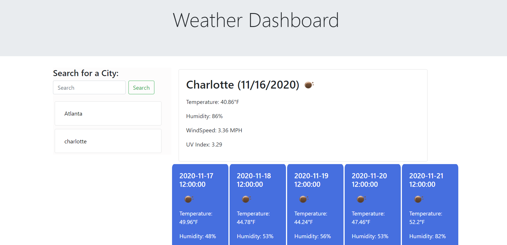

# Weather-Dashboard
This application emphasizes the use of getting information from an api and integrating the data into our html.

## Key Features
* This application allows the user to enter a desired city into the search bar.
* Once the search button is clicked the city name,date,temperature, humidity, wind speed, and uv index will be 
displated to the screen for the user.
under that will also be a 5 day forecast for that city displaying the date, temperature, and humidity.
* A history bar is also displayed under the search for the user to be able to review history of cities searched.

## Website Deployed

**Link**

[Link to deployed weather dashboard](https://lorena-ramirez.github.io/Weather-Dashboard/)